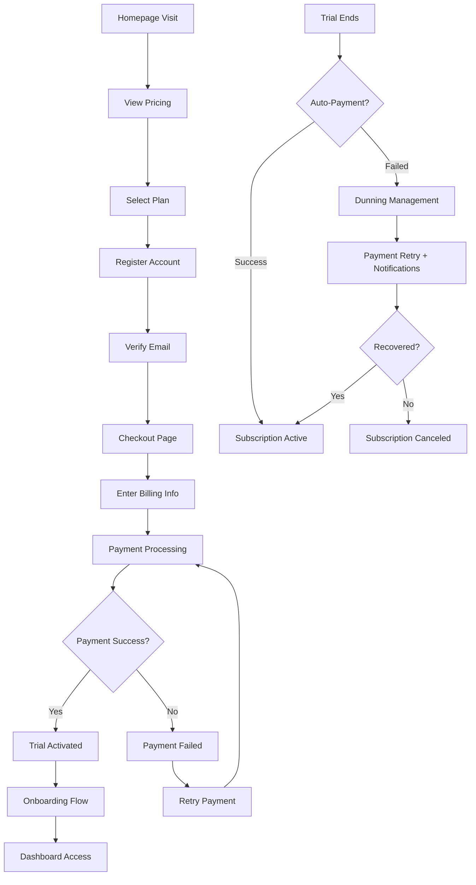

# 💳 Orbyt - Flujo Completo de Suscripción y Pagos

## 🎯 Overview del Sistema de Pagos

### **Tecnologías Principales**
- **Stripe**: Procesamiento de pagos y suscripciones
- **Angular**: Frontend con Stripe Elements
- **Node.js/NestJS**: Backend API
- **PostgreSQL**: Persistencia de datos
- **Redis**: Cache y sessions

### **Tipos de Pago Soportados**
- 💳 **Tarjetas de crédito/débito** (Visa, Mastercard, American Express)
- 🏦 **SEPA Direct Debit** (Europa)
- 💰 **PayPal** (opcional, integración futura)
- 🇪🇸 **Bizum** (España, integración futura)

---

## 🗺️ Mapa del User Journey Completo



---

## 📋 Estados de Suscripción y Transiciones

### **Estados Posibles**
```typescript
enum SubscriptionStatus {
  INCOMPLETE = 'incomplete',           // Pago inicial fallido
  INCOMPLETE_EXPIRED = 'incomplete_expired', // 23 horas sin completar
  TRIALING = 'trialing',              // En período de prueba
  ACTIVE = 'active',                  // Suscripción activa y al día
  PAST_DUE = 'past_due',             // Pago fallido, en período de gracia
  CANCELED = 'canceled',              // Cancelada por usuario
  UNPAID = 'unpaid'                   // Múltiples fallos, suspendida
}
```

### **Máquina de Estados**
```typescript
const stateTransitions = {
  'incomplete': ['active', 'trialing', 'incomplete_expired'],
  'trialing': ['active', 'past_due', 'canceled'],
  'active': ['past_due', 'canceled'],
  'past_due': ['active', 'canceled', 'unpaid'],
  'canceled': [], // Estado final
  'unpaid': ['active', 'canceled']
};
```

---

## 🔄 Flujo Técnico Paso a Paso

### **Paso 1: Registro de Usuario**

#### **Frontend Request**
```typescript
// register.component.ts
async register(formData: RegistrationData) {
  try {
    const response = await this.authService.register({
      email: formData.email,
      password: formData.password,
      firstName: formData.firstName,
      lastName: formData.lastName,
      companyName: formData.companyName,
      selectedPlan: formData.planSlug,
      utmData: this.getUtmData()
    });
    
    // Store temporary auth token
    this.authService.setTempToken(response.tempToken);
    
    // Redirect to email verification
    this.router.navigate(['/auth/verificar-email']);
    
  } catch (error) {
    this.handleRegistrationError(error);
  }
}

private getUtmData() {
  return {
    utm_source: this.getUrlParam('utm_source'),
    utm_medium: this.getUrlParam('utm_medium'), 
    utm_campaign: this.getUrlParam('utm_campaign'),
    referrer: document.referrer
  };
}
```

#### **Backend Processing**
```typescript
// auth.controller.ts
@Post('register')
async register(@Body() dto: CreateUserDto) {
  // 1. Validate input data
  await this.validateRegistrationData(dto);
  
  // 2. Check if user already exists
  const existingUser = await this.usersService.findByEmail(dto.email);
  if (existingUser) {
    throw new ConflictException('User already exists');
  }
  
  // 3. Create user with unverified status
  const user = await this.usersService.create({
    ...dto,
    status: 'lead',
    emailVerified: false,
    emailVerificationToken: this.generateToken()
  });
  
  // 4. Send verification email
  await this.emailService.sendVerificationEmail(user);
  
  // 5. Track registration event
  await this.analyticsService.trackEvent('user_registered', {
    userId: user.id,
    plan: dto.selectedPlan,
    source: dto.utmData
  });
  
  return {
    success: true,
    tempToken: this.jwtService.signTemp({ userId: user.id }),
    message: 'Please verify your email'
  };
}
```

### **Paso 2: Verificación de Email**

```typescript
// email-verification.component.ts
async verifyEmail(token: string) {
  try {
    const response = await this.authService.verifyEmail(token);
    
    // Store full auth token
    this.authService.setAuthToken(response.token);
    
    // Redirect to checkout with pre-selected plan
    const redirectUrl = `/checkout/plan/${response.user.selectedPlan}`;
    this.router.navigate([redirectUrl]);
    
  } catch (error) {
    this.showError('Token inválido o expirado');
  }
}
```

### **Paso 3: Checkout e Inicialización de Stripe**

#### **Plan Selection & Setup**
```typescript
// checkout.component.ts
export class CheckoutComponent implements OnInit {
  stripe: Stripe;
  elements: StripeElements;
  cardElement: StripeCardElement;
  
  selectedPlan: PricingPlan;
  billingPeriod: 'monthly' | 'yearly' = 'monthly';
  
  paymentForm: FormGroup;
  processing = false;
  
  async ngOnInit() {
    // Initialize Stripe
    this.stripe = await loadStripe(environment.stripePublicKey);
    this.elements = this.stripe.elements();
    
    // Load selected plan
    const planSlug = this.route.snapshot.params['slug'];
    this.selectedPlan = await this.planService.getPlan(planSlug);
    
    // Setup form
    this.initializeForm();
    this.setupStripeElements();
  }
  
  private setupStripeElements() {
    // Create card element with custom styling
    this.cardElement = this.elements.create('card', {
      style: {
        base: {
          fontSize: '16px',
          color: '#424770',
          '::placeholder': { color: '#aab7c4' },
          fontFamily: '"Inter", sans-serif'
        }
      }
    });
    
    this.cardElement.mount('#stripe-card-element');
    
    // Listen for card validation errors
    this.cardElement.on('change', ({error}) => {
      this.displayError(error ? error.message : '');
    });
  }
}
```

#### **Billing Form Setup**
```typescript
private initializeForm() {
  this.paymentForm = this.fb.group({
    // Billing Information
    fullName: ['', [Validators.required, Validators.minLength(2)]],
    company: [''],
    email: [{value: this.currentUser.email, disabled: true}],
    
    // Address
    addressLine1: ['', Validators.required],
    addressLine2: [''],
    city: ['', Validators.required],
    postalCode: ['', [Validators.required, this.validatePostalCode]],
    country: ['ES', Validators.required],
    
    // Tax Information
    taxId: ['', this.validateTaxId],
    
    // Preferences
    billingPeriod: ['monthly'],
    acceptTerms: [false, Validators.requiredTrue],
    marketingConsent: [false]
  });
  
  // Watch country changes to update tax validation
  this.paymentForm.get('country').valueChanges.subscribe(
    country => this.updateTaxValidation(country)
  );
}

private validateTaxId = (control: AbstractControl) => {
  const country = this.paymentForm?.get('country')?.value;
  const taxId = control.value;
  
  if (!taxId) return null; // Optional field
  
  const validators = {
    'ES': /^[A-Z]\d{8}$|^\d{8}[A-Z]$/, // NIF/CIF España
    'FR': /^FR\d{11}$/, // TVA Francia
    'DE': /^DE\d{9}$/, // USt-IdNr Alemania
  };
  
  const pattern = validators[country];
  if (pattern && !pattern.test(taxId)) {
    return { invalidTaxId: true };
  }
  
  return null;
};
```

### **Paso 4: Procesamiento de Pago**

#### **Create Payment Method**
```typescript
async processPayment() {
  if (!this.paymentForm.valid) {
    this.markFormGroupTouched();
    return;
  }
  
  this.processing = true;
  
  try {
    // Step 1: Create Stripe Payment Method
    const {paymentMethod, error: pmError} = await this.stripe.createPaymentMethod({
      type: 'card',
      card: this.cardElement,
      billing_details: this.getBillingDetails()
    });
    
    if (pmError) {
      throw new Error(pmError.message);
    }
    
    // Step 2: Create subscription on backend
    const subscription = await this.subscriptionService.createSubscription({
      planSlug: this.selectedPlan.slug,
      billingPeriod: this.billingPeriod,
      paymentMethodId: paymentMethod.id,
      billingDetails: this.paymentForm.value,
      trialDays: 14
    });
    
    // Step 3: Handle payment authentication if required
    await this.handlePaymentResult(subscription);
    
  } catch (error) {
    this.processing = false;
    this.displayError(error.message);
    
    // Track failed payment attempt
    this.analytics.track('payment_failed', {
      error: error.message,
      plan: this.selectedPlan.slug
    });
  }
}

private async handlePaymentResult(subscription: any) {
  if (subscription.status === 'requires_action') {
    // 3D Secure or other authentication required
    const {error: confirmError} = await this.stripe.confirmCardPayment(
      subscription.client_secret
    );
    
    if (confirmError) {
      throw new Error(confirmError.message);
    }
  }
  
  if (['active', 'trialing'].includes(subscription.status)) {
    // Success! 
    this.analytics.track('subscription_created', {
      plan: this.selectedPlan.slug,
      amount: subscription.amount
    });
    
    // Redirect to success page
    this.router.navigate(['/checkout/confirmacion'], {
      queryParams: { subscriptionId: subscription.id }
    });
  } else {
    throw new Error('Error inesperado procesando el pago');
  }
}
```

#### **Backend Subscription Creation**
```typescript
// subscription.service.ts
async createSubscription(dto: CreateSubscriptionDto) {
  const user = await this.getCurrentUser();
  
  // 1. Get or create Stripe customer
  let customer = await this.getStripeCustomer(user);
  if (!customer) {
    customer = await this.stripe.customers.create({
      email: user.email,
      name: dto.billingDetails.fullName,
      address: this.formatAddress(dto.billingDetails),
      metadata: { userId: user.id.toString() }
    });
    
    // Save customer ID
    await this.usersService.update(user.id, { 
      stripeCustomerId: customer.id 
    });
  }
  
  // 2. Attach payment method to customer
  await this.stripe.paymentMethods.attach(dto.paymentMethodId, {
    customer: customer.id,
  });
  
  // 3. Set as default payment method
  await this.stripe.customers.update(customer.id, {
    invoice_settings: {
      default_payment_method: dto.paymentMethodId,
    },
  });
  
  // 4. Get plan pricing
  const plan = await this.plansService.findBySlug(dto.planSlug);
  const priceId = dto.billingPeriod === 'yearly' 
    ? plan.stripeYearlyPriceId 
    : plan.stripeMonthlyPriceId;
  
  // 5. Create subscription with trial
  const subscription = await this.stripe.subscriptions.create({
    customer: customer.id,
    items: [{ price: priceId }],
    trial_period_days: dto.trialDays,
    payment_behavior: 'default_incomplete',
    payment_settings: {
      save_default_payment_method: 'on_subscription',
      payment_method_types: ['card']
    },
    expand: ['latest_invoice.payment_intent'],
    metadata: {
      userId: user.id.toString(),
      planSlug: dto.planSlug
    }
  });
  
  // 6. Save subscription in database
  const dbSubscription = await this.subscriptionsRepository.create({
    userId: user.id,
    planId: plan.id,
    stripeSubscriptionId: subscription.id,
    stripeCustomerId: customer.id,
    status: subscription.status,
    trialStart: new Date(subscription.trial_start * 1000),
    trialEnd: new Date(subscription.trial_end * 1000),
    currentPeriodStart: new Date(subscription.current_period_start * 1000),
    currentPeriodEnd: new Date(subscription.current_period_end * 1000),
  });
  
  // 7. Update user status
  await this.usersService.update(user.id, { status: 'trial' });
  
  // 8. Send welcome email
  await this.emailService.sendWelcomeEmail(user, subscription);
  
  return {
    id: dbSubscription.id,
    status: subscription.status,
    client_secret: subscription.latest_invoice.payment_intent.client_secret,
    trialEnd: subscription.trial_end,
    amount: subscription.items.data[0].price.unit_amount / 100
  };
}
```

### **Paso 5: Webhook Handling**

```typescript
// webhook.controller.ts
@Post('stripe')
async handleStripeWebhook(@Body() body: any, @Headers() headers: any) {
  const signature = headers['stripe-signature'];
  let event: Stripe.Event;
  
  try {
    event = this.stripe.webhooks.constructEvent(
      body, signature, process.env.STRIPE_WEBHOOK_SECRET
    );
  } catch (err) {
    throw new BadRequestException(`Webhook signature verification failed`);
  }
  
  // Handle different event types
  switch (event.type) {
    case 'invoice.payment_succeeded':
      await this.handlePaymentSucceeded(event.data.object);
      break;
      
    case 'invoice.payment_failed':
      await this.handlePaymentFailed(event.data.object);
      break;
      
    case 'customer.subscription.updated':
      await this.handleSubscriptionUpdated(event.data.object);
      break;
      
    case 'customer.subscription.deleted':
      await this.handleSubscriptionCanceled(event.data.object);
      break;
      
    case 'customer.subscription.trial_will_end':
      await this.handleTrialEnding(event.data.object);
      break;
      
    default:
      console.log(`Unhandled event type: ${event.type}`);
  }
  
  return { received: true };
}

private async handlePaymentSucceeded(invoice: Stripe.Invoice) {
  const subscription = await this.findSubscriptionByStripeId(
    invoice.subscription as string
  );
  
  if (!subscription) return;
  
  // Update subscription status
  await this.subscriptionsRepository.update(subscription.id, {
    status: 'active',
    lastPaymentDate: new Date()
  });
  
  // Update user status
  await this.usersService.update(subscription.userId, { status: 'active' });
  
  // Create invoice record
  await this.invoicesService.create({
    userId: subscription.userId,
    subscriptionId: subscription.id,
    stripeInvoiceId: invoice.id,
    amount: invoice.amount_paid / 100,
    currency: invoice.currency,
    status: 'paid',
    paidAt: new Date(invoice.status_transitions.paid_at * 1000)
  });
  
  // Send payment confirmation email
  const user = await this.usersService.findById(subscription.userId);
  await this.emailService.sendPaymentConfirmation(user, invoice);
}

private async handlePaymentFailed(invoice: Stripe.Invoice) {
  const subscription = await this.findSubscriptionByStripeId(
    invoice.subscription as string
  );
  
  // Update subscription to past_due
  await this.subscriptionsRepository.update(subscription.id, {
    status: 'past_due'
  });
  
  // Start dunning management process
  await this.dunningService.handleFailedPayment(subscription, invoice);
}
```

---

## 🔔 Sistema de Dunning Management

### **Estrategia de Recuperación de Pagos**

```typescript
// dunning.service.ts
export class DunningService {
  
  async handleFailedPayment(subscription: Subscription, invoice: Stripe.Invoice) {
    const user = await this.usersService.findById(subscription.userId);
    const attemptNumber = await this.getFailedAttempts(subscription.id);
    
    // Schedule retry attempts
    const retrySchedule = [1, 3, 5, 7]; // días
    
    if (attemptNumber <= retrySchedule.length) {
      // Schedule next retry
      const nextRetry = retrySchedule[attemptNumber - 1];
      await this.schedulePaymentRetry(subscription, nextRetry);
      
      // Send appropriate notification
      await this.sendDunningEmail(user, subscription, attemptNumber);
      
    } else {
      // All retries failed - cancel subscription
      await this.cancelSubscriptionForNonPayment(subscription);
    }
  }
  
  private async sendDunningEmail(user: User, subscription: Subscription, attempt: number) {
    const templates = {
      1: 'payment_failed_first_attempt',
      2: 'payment_failed_second_attempt', 
      3: 'payment_failed_final_warning',
      4: 'subscription_canceled'
    };
    
    await this.emailService.sendTemplate(templates[attempt], user, {
      subscription,
      updatePaymentUrl: `${process.env.APP_URL}/dashboard/billing`
    });
  }
}
```

---

## 📊 Analytics y Tracking

### **Eventos de Conversión**
```typescript
// analytics.service.ts
export class AnalyticsService {
  
  trackCheckoutStep(step: string, planSlug: string, userId?: string) {
    // Google Analytics 4
    gtag('event', 'begin_checkout', {
      currency: 'EUR',
      value: this.getPlanValue(planSlug),
      items: [{
        item_id: planSlug,
        item_name: this.getPlanName(planSlug),
        item_category: 'subscription',
        quantity: 1,
        price: this.getPlanValue(planSlug)
      }]
    });
    
    // Mixpanel
    mixpanel.track('Checkout Step', {
      step: step,
      plan: planSlug,
      user_id: userId
    });
  }
  
  trackPurchase(subscription: Subscription, amount: number) {
    // GA4 Purchase Event
    gtag('event', 'purchase', {
      transaction_id: subscription.id,
      value: amount,
      currency: 'EUR',
      items: [{
        item_id: subscription.plan.slug,
        item_name: subscription.plan.name,
        item_category: 'subscription',
        quantity: 1,
        price: amount
      }]
    });
    
    // Facebook Pixel
    fbq('track', 'Purchase', {
      value: amount,
      currency: 'EUR'
    });
  }
}
```

---

## 🚨 Manejo de Errores Comunes

### **Errores de Stripe y Soluciones**

```typescript
// error-handler.service.ts
export class PaymentErrorHandler {
  
  handleStripeError(error: Stripe.StripeError): UserFriendlyError {
    const errorMessages: Record<string, string> = {
      // Card errors
      'card_declined': 'Tu tarjeta fue rechazada. Intenta con otra tarjeta.',
      'insufficient_funds': 'Fondos insuficientes. Verifica el saldo de tu tarjeta.',
      'expired_card': 'Tu tarjeta ha expirado. Actualiza la información de pago.',
      'incorrect_cvc': 'El código CVC es incorrecto.',
      'processing_error': 'Error procesando el pago. Intenta de nuevo.',
      
      // Authentication errors  
      'authentication_required': 'Tu banco requiere autenticación adicional.',
      
      // Rate limiting
      'rate_limit': 'Demasiados intentos. Espera un momento antes de intentar de nuevo.',
      
      // Generic
      'generic_decline': 'El pago no pudo ser procesado. Contacta a tu banco.'
    };
    
    return {
      message: errorMessages[error.code] || 'Error inesperado. Intenta de nuevo.',
      code: error.code,
      shouldRetry: this.isRetryableError(error.code),
      suggestedActions: this.getSuggestedActions(error.code)
    };
  }
  
  private getSuggestedActions(errorCode: string): string[] {
    const actions: Record<string, string[]> = {
      'card_declined': [
        'Verifica que los datos de la tarjeta sean correctos',
        'Intenta con una tarjeta diferente',
        'Contacta a tu banco'
      ],
      'insufficient_funds': [
        'Verifica el saldo disponible',
        'Usa una tarjeta con suficientes fondos'
      ]
    };
    
    return actions[errorCode] || ['Contacta a soporte si el problema persiste'];
  }
}
```

### **Retry Logic con Exponential Backoff**

```typescript
// payment-retry.service.ts
export class PaymentRetryService {
  
  async retryPaymentWithBackoff(paymentMethodId: string, amount: number, maxRetries = 3) {
    let attempt = 1;
    
    while (attempt <= maxRetries) {
      try {
        const result = await this.stripe.paymentIntents.create({
          amount: amount * 100,
          currency: 'eur',
          payment_method: paymentMethodId,
          confirm: true
        });
        
        return result;
        
      } catch (error) {
        if (attempt === maxRetries || !this.isRetryableError(error)) {
          throw error;
        }
        
        // Exponential backoff: 1s, 2s, 4s
        const delay = Math.pow(2, attempt - 1) * 1000;
        await this.sleep(delay);
        attempt++;
      }
    }
  }
}
```

---

## ✅ Checklist de Testing

### **Testing Frontend**
- [ ] Formularios de registro con validaciones
- [ ] Integración Stripe Elements
- [ ] Flujo completo de checkout
- [ ] Manejo de errores de pago
- [ ] Responsive en móviles
- [ ] Navegación entre pasos

### **Testing Backend**
- [ ] Creación de suscripciones
- [ ] Webhook handling
- [ ] Manejo de pagos fallidos
- [ ] Sistema de dunning
- [ ] Cancelaciones y reactivaciones
- [ ] Facturación automática

### **Testing de Integración**
- [ ] Flujo end-to-end completo
- [ ] Sincronización Stripe ↔ Database
- [ ] Emails transaccionales
- [ ] Analytics tracking
- [ ] Casos edge (network failures, etc.)

---

**Resultado**: Un sistema de pagos y suscripciones completamente funcional, robusto y preparado para producción, con manejo de errores, recuperación de pagos fallidos y experiencia de usuario optimizada.